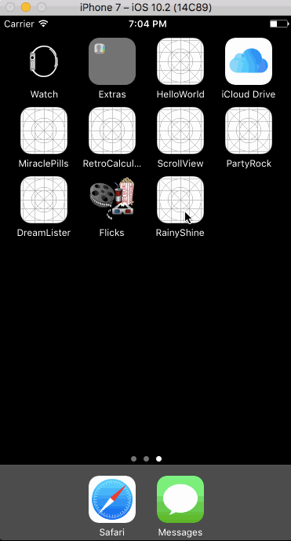

# RainyShine

##Description:
An app that displays the current weather, as well as the next nine days, based on the user's location; written in Swift as a tutorial project for Devslopes. This app was built to learn the concepts of REST and web requests using Alamofire.

##Demo:
